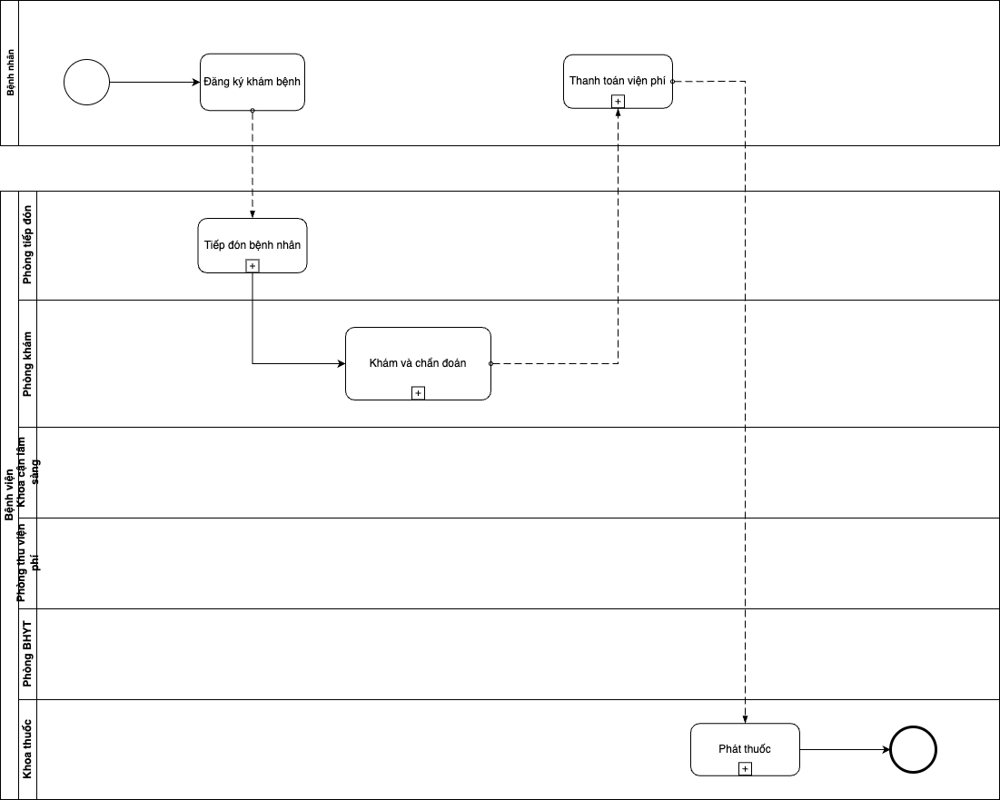
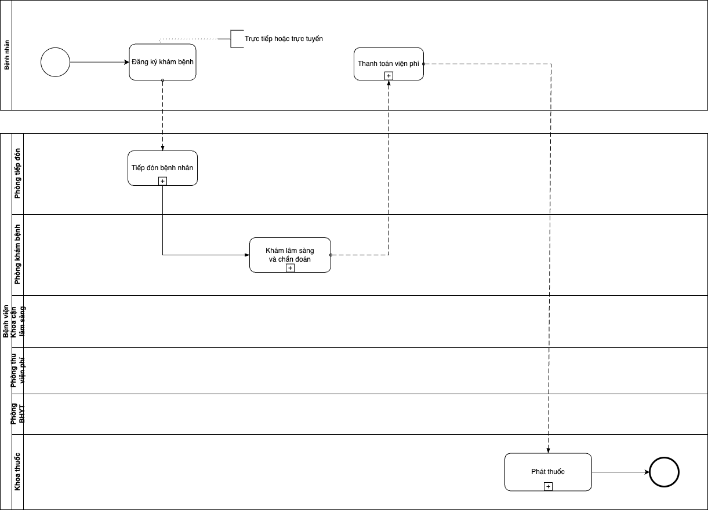
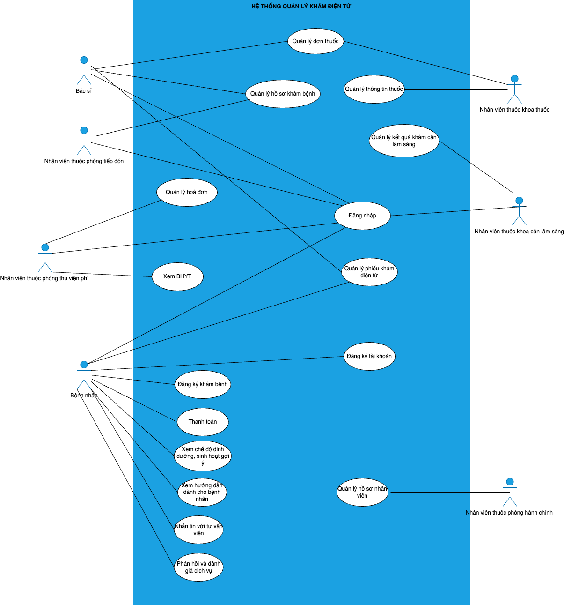

# Hospital-Management-BA-Project
End-to-end business analysis project to transform a manual hospital process into a digital system, focusing on process optimization, requirement engineering, and user-centric design.
# 1. Project Overview
This project focuses on analyzing and redesigning the hospital outpatient process for a dental hospital in Vietnam.

The objective is to identify inefficiencies in the current manual process and propose a digital solution to improve patient experience and operational efficiency.
# 2. Business Problem
The current system is mostly manual, involving paper-based processes and fragmented communication between departments.

Key problems:
- Long waiting time
- Data inconsistency
- Inefficient coordination across departments
- Lack of centralized patient data
# 3. Solution Overview (To-Be)
Proposed a digital hospital management system that:
- Enables online appointment booking
- Centralizes patient data
- Automates payment and prescription processes
- Improves cross-department communication
# 4. Key Deliverables
- Business Process Model (BPMN)
- Stakeholder Analysis
- Requirement Specification (BRD/FRD)
- Use Case Diagram & Specifications
- Entity Relationship Diagram (ERD)
- Class Diagram
# 5. Diagrams
### As-Is Business Process

### To-Be Business Process

### Use Case Diagram

# 6. Tools & Skills
- Business Analysis
- Requirement Gathering
- BPMN
- UML (Use Case, Class Diagram)
- Stakeholder Analysis
- Problem Solving
# 7. Business Impact
Expected Impact:
- Reduce patient waiting time by ~30%
- Improve data accuracy
- Enhance patient experience
